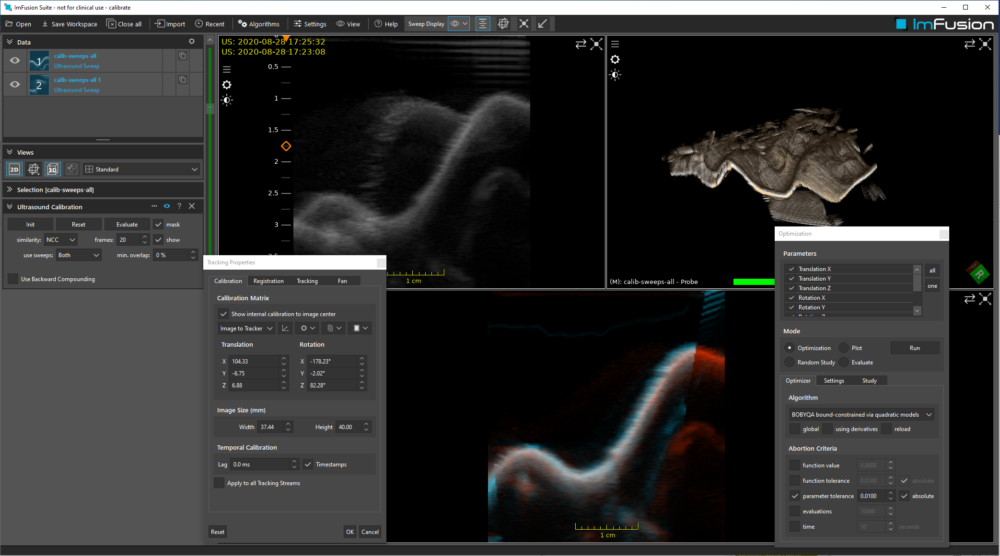

# Ultrasound Calibration

## Summary

This dataset contains two sweeps acquired in an orthogonal fashion. They are only rougly calibrated, but within the capture range of the algorithm.

The algorithm 'Ultrasound Calibration' optimizes the calibration matrix of both sweeps until there is best overlap between them (similar to what an image registration does). It implements Wein et al. (SPIE 2008).

For more information on how to calibrate an ultrasound probe, look here:
1. [Tutorial Video of Ultrasound Calibration Wizard](https://www.youtube.com/watch?v=qsbH9BoXvi8)
2. [PRO-TIP](https://github.com/ImFusionGmbH/PRO-TIP-Automatic-Ultrasound-Calibration) calibration method

Both of the methods above are available in the ImFusion SDK / Suite, and help to initialize the calibration matrix. Internally, the both find the final matrix by running the image-based 'Ultrasound Calibration' afterwards.

## License Information

Phantom data acquired at ImFusion GmbH.
License: [CC Attribution 4.0 International (CC BY 4.0)](https://creativecommons.org/licenses/by/4.0/)

## Citations

    Wein, Wolfgang, and Ali Khamene. "Image-based method for in-vivo freehand ultrasound calibration." In Medical Imaging 2008: Ultrasonic Imaging and Signal Processing, vol. 6920, pp. 179-185. SPIE, 2008.
    Ronchetti, Matteo, Julia Rackerseder, Maria Tirindelli, Mehrdad Salehi, Nassir Navab, Wolfgang Wein, and Oliver Zettinig. "PRO-TIP: Phantom for RObust automatic ultrasound calibration by TIP detection." In International Conference on Medical Image Computing and Computer-Assisted Intervention, pp. 84-93. Springer, Cham, 2022.
