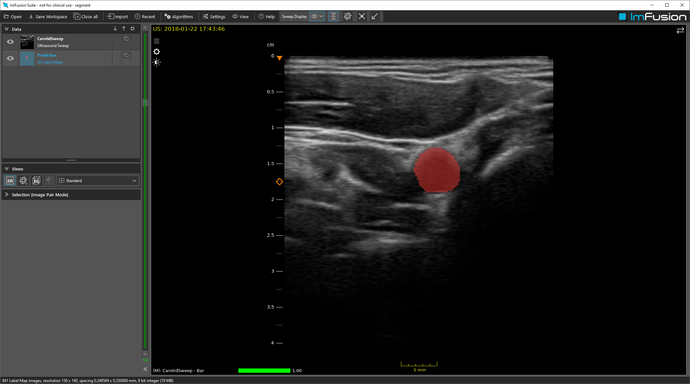

# Carotid Segmentation

## Summary

This dataset contains a caroid artery B-mode example and a simple Torch model (U-net) to segment the artery automatically in it.

The model was trained only on a very limited set of recordings on a single scanner, so it's not expected to generalize well to other subjects or scanners.

## License Information

This data was acquired from volunteers, who are part of the ImFusion GmbH team. They have consented to publication of their data.
License: [CC Attribution 4.0 International (CC BY 4.0)](https://creativecommons.org/licenses/by/4.0/)

