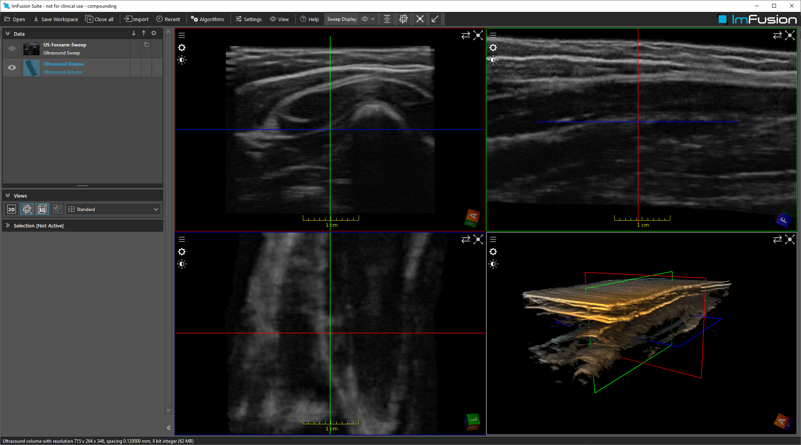

# Sweep Compounding

## Summary

This dataset contains a forarm B-mode example. The workspace runs the 'Sweep Compounding' algorithm to reconstruct a 3D volume from it.

## License Information

This data was acquired from volunteers, who are part of the ImFusion GmbH team. They have consented to publication of their data.
License: [CC Attribution 4.0 International (CC BY 4.0)](https://creativecommons.org/licenses/by/4.0/)

