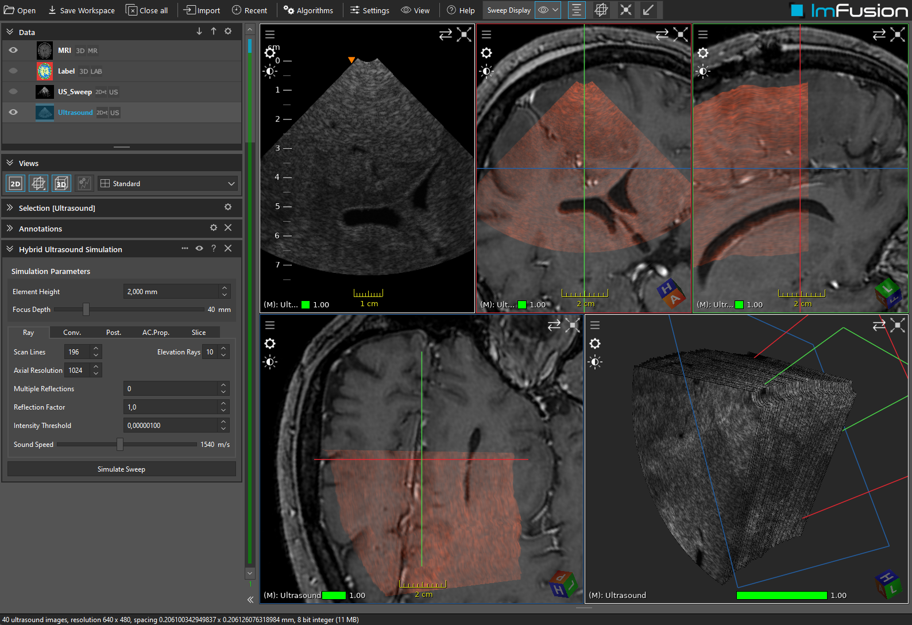

# Ultrasound Simulation

## Summary

This dataset contains an MRI, a corresponding label map, and a reference sweep to run the hybrid ultrasound simulation.

This work was published at MICCAI 2015 (see below). Please examine the workspace (iws) file to see the full list of acoustic parameters considered.

## License Information

Dataset is part of the efforts of Xiao et al., Med. Phys 2017 (see below).
Dataset: https://archive.norstore.no/pages/public/datasetDetail.jsf?id=10.11582/2017.00004

License: Creative Commons Attribution 4.0 International Public License
https://creativecommons.org/licenses/by/4.0/

## Citations

    Salehi, M., Ahmadi, S. A., Prevost, R., Navab, N., & Wein, W. Patient-specific 3D ultrasound simulation based on convolutional ray-tracing and appearance optimization. In International Conference on Medical Image Computing and Computer-Assisted Intervention (pp. 510-518), 2015.
	Xiao, Y., Fortin, M., Unsgård, G., Rivaz, H. and Reinertsen, I. (2017), REtroSpective Evaluation of Cerebral Tumors (RESECT): A clinical database of pre-operative MRI and intra-operative ultrasound in low-grade glioma surgeries. Med. Phys.. doi:10.1002/mp.12268 (primary)
	https://aapm.onlinelibrary.wiley.com/doi/full/10.1002/mp.12268
