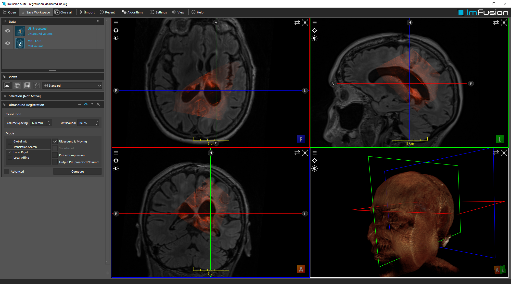

# Ultasound Volume Registration

## Summary

This dataset contains MRI and B-mode ultrasound scans part of the RESECT dataset. Two workspace files are provided to register them either with the vanilla 'Image Registration' algorithm or the dedicated 'Ultrasound Registration' algorithm.

## License Information

Dataset is part of the efforts of Xiao et al., Med. Phys 2017 (see below).
Dataset: https://archive.norstore.no/pages/public/datasetDetail.jsf?id=10.11582/2017.00004

License: Creative Commons Attribution 4.0 International Public License
https://creativecommons.org/licenses/by/4.0/

## Citations

	Xiao, Y., Fortin, M., Unsgård, G., Rivaz, H. and Reinertsen, I. (2017), REtroSpective Evaluation of Cerebral Tumors (RESECT): A clinical database of pre-operative MRI and intra-operative ultrasound in low-grade glioma surgeries. Med. Phys.. doi:10.1002/mp.12268 (primary)
	https://aapm.onlinelibrary.wiley.com/doi/full/10.1002/mp.12268

