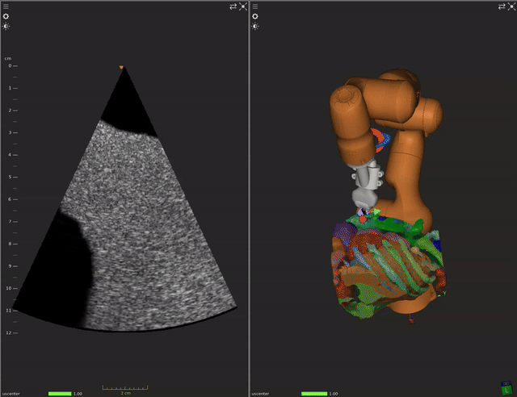

# Robotics Ultrasound Demo

This demo attempts to show the capabilities of the ImFusionSuite to perform an Robotics Ultrasound simulation in which, from an already segmented CT scan and a simulated Robot with an ultrasound probe as a tool at the TCP, a simulated US scan can be run.

Pre-requisites:
- Make sure you have a NVidia GPU and nvidia drivers are active for best performance

In order to run the demo:
1. Run `ImFusionSuite RoboticsUltrasoundDemo.iws` and click `Start stream` on the newly created `Virtual Imaging Algorithm` widget.
2. Select `Robot US TrackingStream` and `Image Stream` on the `Data` section, right-click somewhere on the `Data` section, Ultrasound->Record Ultrasound Sweeps
    - In the `Advanced settings` section, reduce the `Sweep buffer` from 50 to 1 to improve performance
3. Move around the goal TCP of the robot to any desired position and click `Go` at the bottom of the the `Manage Robot Stream` widget.

If you adjust the short-long radius of the Virtual Imaging Algorithm, don't forget to adjust the Calibration data of the Tracking stream: select the `Robot US Tracking Stream` in the `Data` section, right-click on the `Data` section, Streaming->Tracking Stream Properties
Some considerations:
- The x-y axis are the ones contained in the plane of the slice that you can see
- The y-direction is the one that goes on the same direction as the z-axis of the TCP of the Robot
- A tuning of this is needed because the computation of the slice is performed based on this parameter, which with a (x,y,z) = (0,0,0) in the translational part of the calibration, it will interpret that the center of the slice is at the same point as the origin of the tracking pose (which, in this case, is the TCP of the robot)

## Additional considerations

All the other source files show how a new Algorithm can be integrated into the ImFusion Suite. In particular, the CTToMediumAlgorithm files implement an algorithm that gets the output of a Segmentation Map from a CT (using one of our Machine Learning models), and rename the labels to the type of medium/material that the Ultrasound simulation will use. All the other header/implementation files show how then that algorithm can be integrated into the Suite by creating a new Plugin (RoboticsUltrasoundDemoPlugin).
