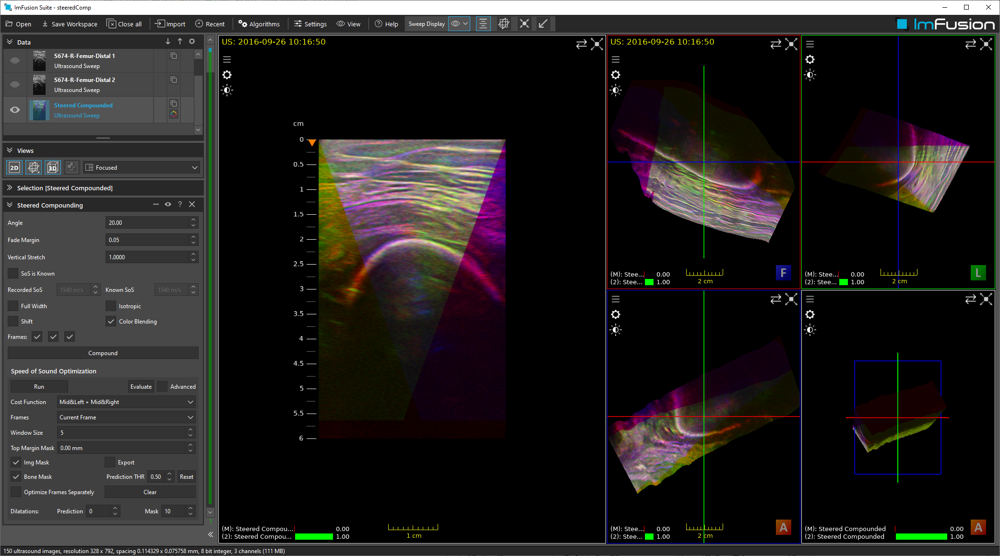

# Ultrasound Simulation

## Summary

This dataset contains a ultrasound sweep, where per frame, three separate beam steering angles were used. The are compounded together to optimize speed-of-sound of the entire acquisition.

This work was published at MICCAI 2017 (see below).

## License Information

This data was acquired from volunteers, who are part of the ImFusion GmbH team. They have consented to publication of their data.
License: [CC Attribution 4.0 International (CC BY 4.0)](https://creativecommons.org/licenses/by/4.0/)

## Citations

    M. Salehi, R. Prevost, J.-L. Moctezuma, N. Navab, W. Wein. Precise Ultrasound Bone Registration with Learning-based Segmentation and Speed of Sound Calibration. International Conference on Medical Image Computing and Computer-Assisted Intervention (MICCAI), Quebec City, Canada, September 2017.

